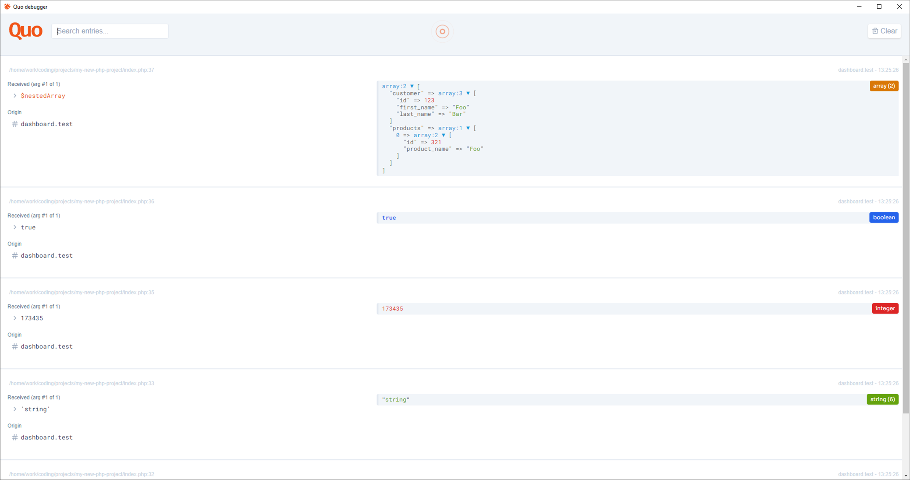

            
        
    

# Quo

> Quo is currently in beta, releases are only available as zip unless you built Quo yourself.

[Quo is a free, open-source, client-side debugger and can be found here](https://github.com/Protoqol/Quo).

Quo is a debugging companion to help you debug dumped variables, the dumped variables will appear in this Quo client
instead of the
traditional way which is often tedious.

### Want to help keep open-source sustainable?

You can help by contributing to the code or donating using the button below!
Both are highly appreciated and contribute directly to keeping open-source free and sustainable!

<form action="https://www.paypal.com/donate" method="post" target="_top">
<input type="hidden" name="hosted_button_id" value="TJS5BKNE3JGW8" />
<input type="image" src="https://www.paypalobjects.com/en_US/i/btn/btn_donate_LG.gif" border="0" name="submit" title="PayPal - The safer, easier way to pay online!" alt="Donate with PayPal button" />

</form>

### Companion packages

- [Quo-PHP](https://github.com/Protoqol/Quo-php)

## Install (only zip available for now)

1. Head over to the [releases](https://github.com/Protoqol/Quo/releases)
2. Look for the latest version
3. Download the zip for your OS (quo-darwin-\*.zip for macOS, quo-linux-\*.zip for Linux, quo-win32-\*.zip for windows)
4. Extract wherever, and run the Quo executable.

- You need a companion package like [Quo-php](https://github.com/Protoqol/Quo-php) to send variables to Quo.
- Default hostname and port for Quo are 127.0.0.1:7312.

## Features

- See dump output
- See which variable was dumped (name or value)
- Organisation with tabs to filter by domain
- Search for output
- Nested variables unfolding

## Issues

#### Issues, bugs and feature requests can be reported [here!](https://github.com/Protoqol/quo-php/issues/new/choose)

## Contributing

See [Contributing](CONTRIBUTING.md) to see how you can contribute to Quo!

## Contributors

- [Quinten Justus](https://github.com/QuintenJustus)
- [Contributors](https://github.com/Protoqol/quo-php/graphs/contributors)

## License

Quo is licensed under the MIT License. Please see [License File](LICENSE) for more information.
